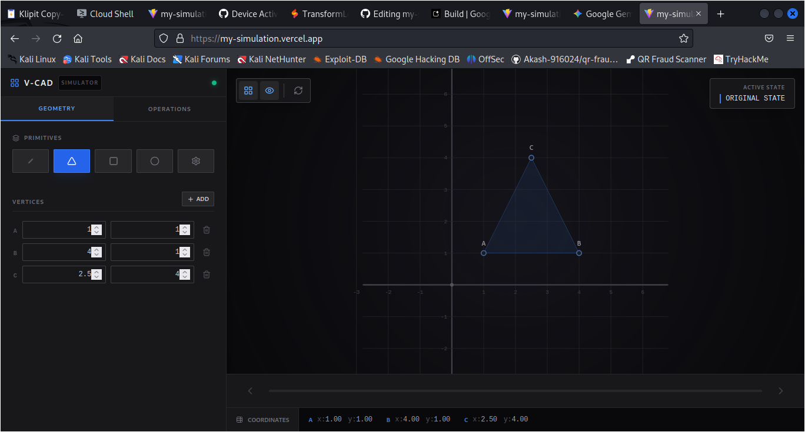

# 2D Transformation Simulator 📐

A web-based interactive tool specifically designed to visualize 2D geometric transformations. This project helps users understand how mathematical transformations like translation, rotation, and scaling affect objects in a coordinate system.

🚀 **[View Live Demo on Vercel](https://my-simulation.vercel.app)**

---

## 📸 Screenshots


## ✨ Features

* **Interactive Controls:** Adjust parameters for X and Y coordinates, angles, and scaling factors using sliders or input fields.
* **Real-time Rendering:** See the object transform instantly as you manipulate the values.
* **Matrix Visualization:** (Optional: If your app shows the matrix) Displays the underlying transformation matrix updates in real-time.
* **Reset Function:** Quickly return the object to its original state.
* **Responsive Design:** Works smoothly on desktop and tablet devices.

## 🛠️ Tech Stack

* **Frontend:** React.js
* **Styling:** CSS / Styled Components
* **Deployment:** Vercel

## 🚀 Getting Started Locally

If you want to run this project on your local machine, follow these steps:

1.  **Clone the repository**
    ```bash
    git clone [https://github.com/Akashps-916024/my-simulation.git](https://github.com/Akashps-916024/my-simulation.git)
    cd my-simulation
    ```

2.  **Install dependencies**
    ```bash
    npm install
    ```

3.  **Run the development server**
    ```bash
    npm run dev
    ```

4.  **Open in Browser**
    Visit `http://localhost:5173` (or the port shown in your terminal) to view the app.

## 🤝 Contributing

Contributions are welcome! If you have suggestions for improvements (like adding 3D transformations or new shapes), feel free to fork the repo and submit a pull request.

1.  Fork the Project
2.  Create your Feature Branch (`git checkout -b feature/NewFeature`)
3.  Commit your Changes (`git commit -m 'Add some NewFeature'`)
4.  Push to the Branch (`git push origin feature/NewFeature`)
5.  Open a Pull Request

## 📄 License

Distributed under the MIT License. See `LICENSE` for more information.

---

*Built with ❤️ by AKASH*
